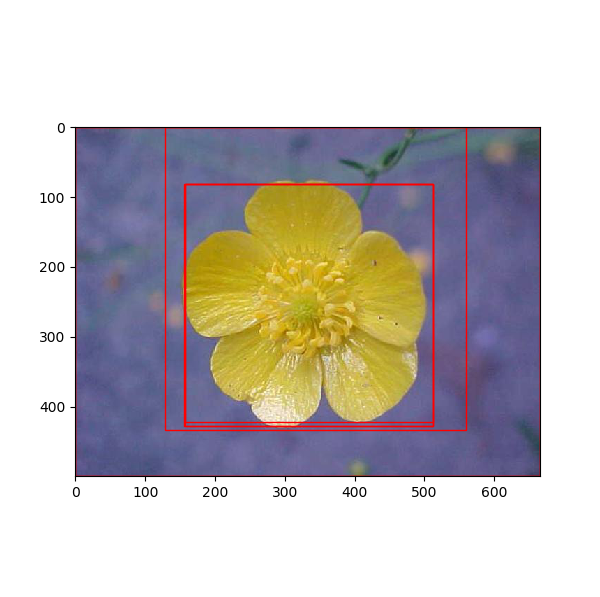
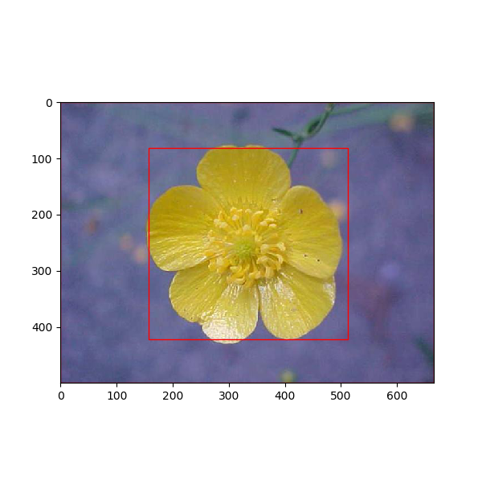

### R-CNN
1、 references:  
https://blog.csdn.net/hjimce/article/details/50187029  
https://www.computer.org/csdl/proceedings/cvpr/2014/5118/00/5118a580-abs.html  
http://www.cnblogs.com/edwardbi/p/5647522.html  
2、some details for improvement  

    a)when training svms,batch is not made from 32 Positive and 96 Negative  

### example       
1、rcnn withou nms     
     
2、rcnn with nms  
     
  

